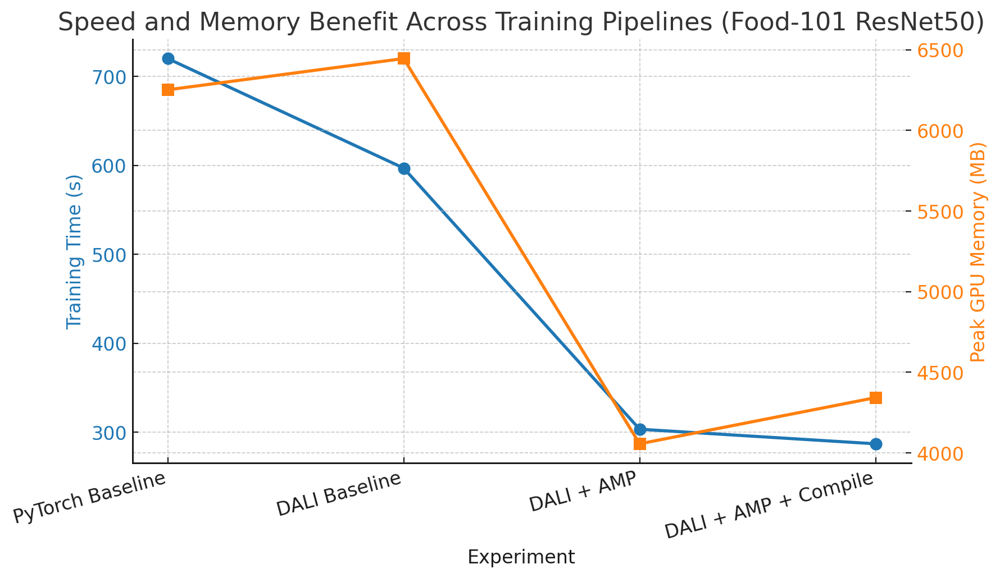

# 🚀 Fast Food101 Training Benchmark: PyTorch vs DALI + AMP + torch.compile

A modern, reproducible benchmark for efficient large-scale image classification.  
**Compares PyTorch DataLoader, NVIDIA DALI pipeline, Automatic Mixed Precision (AMP), and torch.compile on Food-101 using ResNet-50.**

  
  
  

---

## 🌟 Key Features

- **Food-101 Dataset**: 101-class food image classification
- **ResNet-50 Backbone**: Standard ImageNet pre-trained architecture
- **Pipeline Benchmarks**:  
  - Plain PyTorch DataLoader  
  - NVIDIA DALI (GPU-accelerated)  
  - DALI + AMP  
  - DALI + AMP + torch.compile (PyTorch 2.x+)
- **Automatic Download & Preprocessing**
- **Speed and GPU Memory Tracking**
- **Reproducible & Beginner-friendly**

---

## 📈 Results Summary

| Experiment                | Training Time (s) | Accuracy (%) | Peak GPU Memory (MB) |
|---------------------------|-------------------|--------------|----------------------|
| PyTorch Baseline          | 720.2             | 80.28        | 6251.2               |
| DALI Baseline             | 597.0             | 81.12        | 6445.0               |
| DALI + AMP                | 303.4             | 81.24        | 4056.0               |
| DALI + AMP + Compile      | 287.0† | 81.16        | 4342.4               |

†**Excludes initial 95s graph compilation time for `torch.compile` (one-time cost).  

> 🚩 **DALI + AMP halves your training time and memory usage, with no accuracy drop. Adding `torch.compile` gives even more speedup.**

---

## 📊 Visualization

  

---

